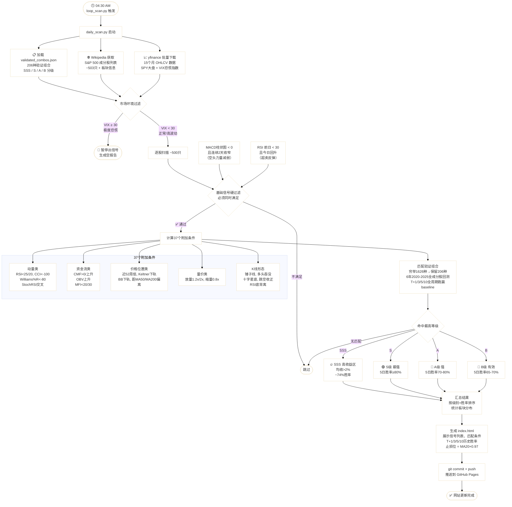

# S&P 500 Daily Signal Scanner

每日自动扫描标普500全成分股，基于技术指标组合评级，生成 HTML 报告并发布到 GitHub Pages。

**网站：** https://fengkaitian.github.io/chucun_scan/

---

## Pipeline



---

## 文件说明

| 文件 | 说明 |
|---|---|
| `daily_scan.py` | 主扫描脚本，运行后生成报告并推送到 GitHub Pages |
| `loop_scan.py` | 定时脚本，每天 04:30 AM 自动触发 |
| `validated_combos.json` | 经6年回测验证的206种信号组合定义 |
| `run_scan.bat` | 手动运行入口 |
| `index.html` | 最新报告（自动生成，每日覆盖） |

---

## 运行方式

**手动运行一次：**
```
python daily_scan.py
```

**开启每日 04:30 AM 自动扫描：**
```
python loop_scan.py
```

---

## 选股逻辑说明

**核心策略：在 MACD 金叉之前入场**

当 MACD 柱状图在零轴下方连续收窄（空头力量减弱），同时 RSI 从超卖区（<30）开始反弹，形成基础信号。在此基础上叠加 37 个附加条件过滤，只推荐在 T+1、T+3、T+5、T+10 全周期均跑赢随机 baseline 的组合。

**评级体系：**

| 等级 | 5日胜率 | 5日中位收益 |
|---|---|---|
| **SSS** 高收益区 | ~74% | +2.0% |
| **S** 最强 | ≥80% | +1.2% |
| **A** 强 | 70–80% | +1.7% |
| **B** 有效 | 65–70% | +1.7% |

> 建议持仓：5个交易日 · 止损参考：MA20 × 0.97  
> 仅供研究参考，不构成投资建议。历史回测不代表未来表现。
